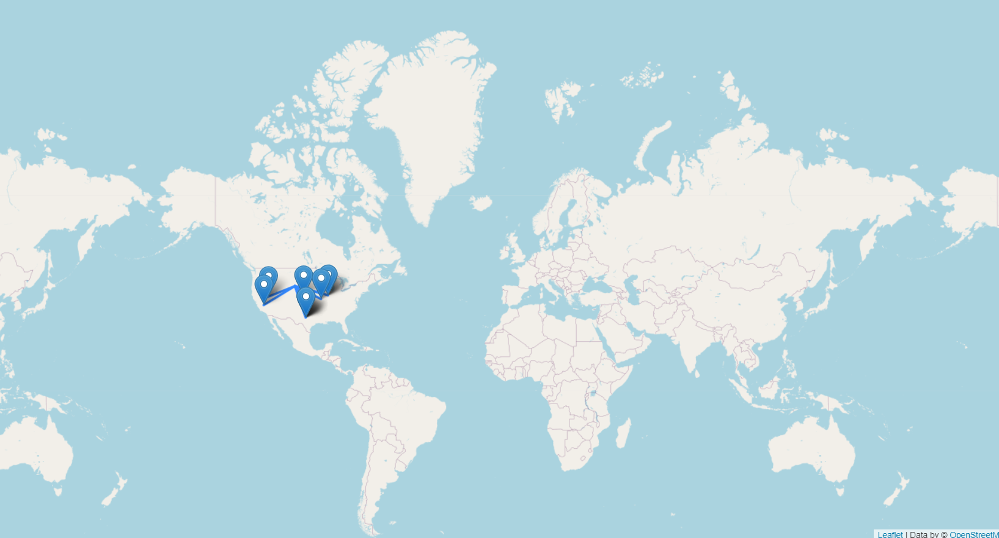

# Map
1. he program is intended to find no more than 10 marks on the world map, which represent each film. A user has to write down an information about a year of films and his location and the program finds 10 most close places and marks them on the map.
2. A usege of the information has different interpritations, but it mostly connected with cinematography. So a user could see where is the highest density of the filmmaking near to the particular area.
3.  - the result with the next input:
                                        1) year = 2015
                                        2) location = 43.295327 -104.537871
4. An HTML-document consists of the typical mark-up, which includes:
1) <head> - a top part of the program, which is not used to execute the code 
2) <body> - a main part of the program, where the program runs
3) <script> - a part of the program that adds js files
4) 
 - a special container that keeps a particular piece of the program